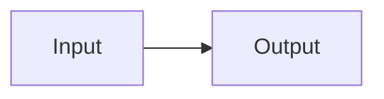

# 02 - Modern-Transformer-Components-Model-Families-and-BERT

The lecture covers:

- A quick recap of Transformers
- Position embeddings and modern variants
- Layer normalization and RMSNorm
- Sparse / sliding-window attention
- Attention head sharing: MHA, GQA, MQA
- Transformer-based model families
- BERT deep dive
- BERT finetuning
- BERT extensions: DistilBERT and RoBERTa

---

## How to install this Wiki

### Option 1: Using the GitHub Wiki web UI

1. Go to your repository.
2. Open the **Wiki** tab.
3. For each file below, create a new page with the exact page name.
   - Example: for `01-Recap-Transformers.md`, create a page named:
     `01-Recap-Transformers`
4. Paste the corresponding content into the page.

For special files such as `_sidebar`, `_header`, and `_footer`, the web UI may not let you create them directly. If that happens:

1. Click **Fork wiki** or open the wiki repository.
2. Create the files with the exact names:
   - `_sidebar.md`
   - `_header.md`
   - `_footer.md`
3. Paste the content.

---

## File list

| File | Purpose |
|---|---|
| `_sidebar.md` | Left-hand navigation sidebar |
| `_header.md` | Header shown above each page |
| `_footer.md` | Footer shown below each page |
| `README.md` | Installation and overview page |
| `Home.md` | Main landing page |
| `01-Recap-Transformers.md` | Recap of self-attention and Transformers |
| `02-Position-Embeddings.md` | Learned, sinusoidal, T5 bias, ALiBi, RoPE |
| `03-Layer-Normalization.md` | LayerNorm, RMSNorm, pre-norm vs post-norm |
| `04-Sparse-Attention.md` | Sparse attention, sliding-window attention |
| `05-Attention-Head-Sharing.md` | MHA, GQA, MQA, KV cache motivation |
| `06-Transformer-Based-Models.md` | Encoder-decoder, encoder-only, decoder-only models |
| `07-BERT-Deep-Dive.md` | BERT architecture, MLM, NSP, special tokens |
| `08-BERT-Finetuning.md` | How BERT is finetuned for downstream tasks |
| `09-BERT-Extensions.md` | DistilBERT, RoBERTa, distillation |

---

## Linking convention

The wiki uses relative Markdown links ending with `.md`, for example:

```markdown
[Home](Home.md)
[Position Embeddings](02-Position-Embeddings.md)
```

This works in GitHub Wikis as long as the file names match exactly.

---

## Diagrams

The wiki uses **Mermaid diagrams** where helpful.

GitHub renders Mermaid diagrams inside Markdown code blocks like this:



If a diagram does not render in your environment, you can copy the Mermaid code into a Mermaid live editor.
